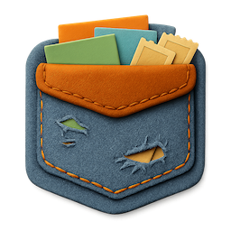

# backpocket



A calm, focused read-it-later app for saving and optionally sharing your finds. No social features, no tracking, no algorithms—just your collection, beautifully organized.

Built as a spiritual successor to Mozilla's Pocket after its shutdown in 2025.

## Features

- **Save anything** — Articles, videos, PDFs, links. We preserve metadata and thumbnails automatically.
- **Stay organized** — Collections, tags, favorites, and archive. Powerful filtering to find what you need.
- **Privacy by default** — Everything starts private. You choose what to share.
- **Share via URL** — Publish your collection at `username.backpocket.my` or your own custom domain.
- **RSS included** — Public saves automatically generate an RSS feed for subscribers.
- **One honest metric** — A simple visitor counter. No cookies, no analytics, no tracking.

## Tech Stack

- **Framework:** [Next.js 16](https://nextjs.org) (App Router)
- **Language:** TypeScript
- **Styling:** [Tailwind CSS 4](https://tailwindcss.com)
- **UI Components:** [Radix UI](https://www.radix-ui.com) + custom components
- **Authentication:** [Clerk](https://clerk.com)
- **Database:** [Supabase](https://supabase.com) (PostgreSQL)
- **Cache:** [Upstash Redis](https://upstash.com)
- **API:** [tRPC](https://trpc.io) + [TanStack Query](https://tanstack.com/query)
- **Linting/Formatting:** [Biome](https://biomejs.dev)
- **Package Manager:** [Bun](https://bun.sh)

## Getting Started

### Prerequisites

- [Bun](https://bun.sh) (recommended) or Node.js 20+
- [Supabase](https://supabase.com) project
- [Clerk](https://clerk.com) application
- [Upstash Redis](https://upstash.com) database (optional, for caching)

### Setup

1. **Clone the repository**

   ```bash
   git clone https://github.com/yourusername/backpocket-web.git
   cd backpocket-web
   ```

2. **Install dependencies**

   ```bash
   bun install
   ```

3. **Set up environment variables**

   Create a `.env.local` file:

   ```env
   # Clerk
   NEXT_PUBLIC_CLERK_PUBLISHABLE_KEY=pk_...
   CLERK_SECRET_KEY=sk_...

   # Supabase
   NEXT_PUBLIC_SUPABASE_URL=https://your-project.supabase.co
   SUPABASE_SERVICE_ROLE_KEY=eyJ...

   # Upstash Redis (optional)
   UPSTASH_REDIS_REST_URL=https://...
   UPSTASH_REDIS_REST_TOKEN=...
   ```

4. **Set up the database**

   Run the schema in your Supabase SQL Editor:

   ```bash
   # The schema is located at:
   supabase/schema.sql
   ```

5. **Run the development server**

   ```bash
   bun dev
   ```

   Open [http://localhost:3000](http://localhost:3000) to see the app.

## Scripts

| Command        | Description              |
| -------------- | ------------------------ |
| `bun dev`      | Start development server |
| `bun build`    | Build for production     |
| `bun start`    | Start production server  |
| `bun lint`     | Check for linting issues |
| `bun lint:fix` | Fix linting issues       |
| `bun format`   | Format code with Biome   |

## Project Structure

```text
├── app/
│   ├── app/          # Authenticated app routes (/app/*)
│   ├── public/       # Public space routes (username.backpocket.my)
│   ├── sign-in/      # Authentication pages
│   ├── sign-up/
│   └── page.tsx      # Landing page
├── components/
│   └── ui/           # Reusable UI components
├── lib/
│   ├── trpc/         # tRPC client and server
│   ├── supabase.ts   # Supabase client
│   └── redis.ts      # Redis client
└── supabase/
    └── schema.sql    # Database schema
```

## License

MIT
